# jit_and_aot
For practice at JIT and AOT course

### CFG examples

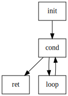\
*CFG for Factorial func*

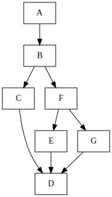\
*CFG for test func #001*

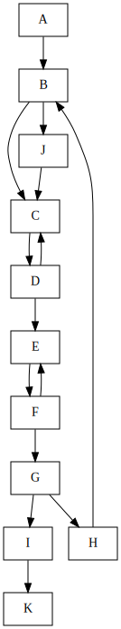\
*CFG for test func #002*

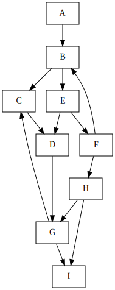\
*CFG for test func #003*

\
*CFG for test func #004*

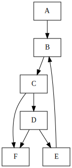\
*CFG for test func #005*

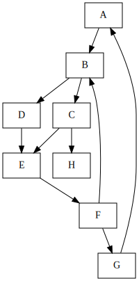\
*CFG for test func #006*

### Dominator tree examples

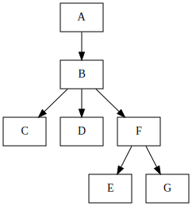\
*Dominator tree for test func #001*

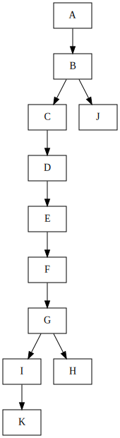\
*Dominator tree for test func #002*

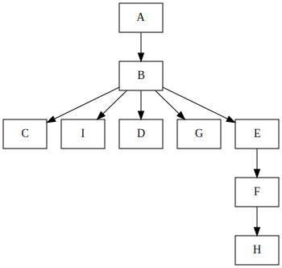\
*Dominator tree for test func #003*

### Loop tree examples

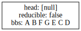\
*Loop tree for test func #001*

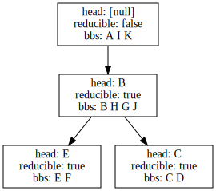\
*Loop tree for test func #002*

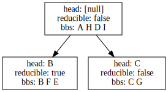\
*Loop tree for test func #003*

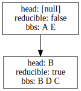\
*Loop tree for test func #004*

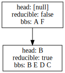\
*Loop tree for test func #005*

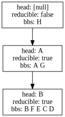\
*Loop tree for test func #006*
