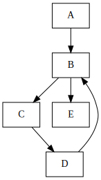

# jit_and_aot
For practice at JIT and AOT course

### CFG examples

\
*CFG for Factorial func*

\
*CFG for test func #001*

\
*CFG for test func #002*

\
*CFG for test func #003*

\
*CFG for test func #004*

\
*CFG for test func #005*

\
*CFG for test func #006*

### Dominator tree examples

\
*Dominator tree for test func #001*

\
*Dominator tree for test func #002*

\
*Dominator tree for test func #003*

### Loop tree examples

\
*Loop tree for test func #001*

\
*Loop tree for test func #002*

\
*Loop tree for test func #003*

\
*Loop tree for test func #004*

\
*Loop tree for test func #005*

\
*Loop tree for test func #006*

### Peephole module

See examples/src/peephole.cpp for jit_aot::peephole module usage example

build/examples/peephole output:

```
IR before peepholes:
i32 foo (i32 %0, i32 %1)
bb1:
  i32 %2 = sub i32 %0, i32 0
  i32 %3 = sub i32 42, i32 0
  i32 %4 = shl i32 %3, i32 10
  i32 %5 = shl i32 %2, i32 0
  i32 %6 = shl i32 0, i32 %1
  i32 %7 = or i32 %2, i32 %3
  i32 %8 = or i32 %7, i32 %4
  i32 %9 = or i32 %8, i32 %5
  i32 %10 = or i32 %9, i32 %6
  return i32 %10


IR after peepholes:
i32 foo (i32 %0, i32 %1)
bb1:
  i32 %7 = or i32 %0, i32 42
  i32 %8 = or i32 %7, i32 43008
  i32 %9 = or i32 %8, i32 %0
  return i32 0
```
